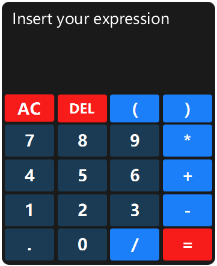

### JavaFX Calculator

> A basic calculator developed in JavaFX

It supports basic arithmetic operations such as `addition`, `subtraction`, 
`multiplication`, `division` and `brackets` as well as control operations such as
`All Clear` and `delete`.    
  
***
**note**: use `alt + F4` to close the app
#### Preview 

